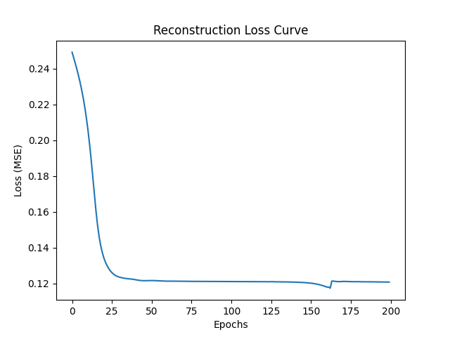

# 🎵 Music Generation with LSTM Autoencoders

A deep learning project focused on unsupervised learning of drum patterns from the **Groove MIDI Dataset**. This project implements an LSTM-based Autoencoder to compress musical sequences into a latent space and generate new, original drum rhythms.

## 🚀 Project Overview (Task 1)
This phase focuses on building the foundational architecture:
- **Preprocessing:** Converts raw MIDI files into 6-channel quantized piano-roll matrices (Kick, Snare, Hi-Hat, Tom, Crash, Ride).
- **Architecture:** An LSTM-based Encoder-Decoder model.
- **Latent Space:** A 32-dimensional bottleneck ($z$) that captures the "essence" of a drum groove.
- **Generation:** Randomly sampling from the latent space to synthesize new MIDI drum loops.

## 🛠️ Tech Stack
- **Language:** Python 3.13
- **Deep Learning:** PyTorch
- **MIDI Processing:** Mido, Matplotlib, NumPy
- **Compute:** NVIDIA CUDA (GPU Accelerated)

## 📊 Results
### Training Performance
The model was trained for 200 epochs, effectively minimizing reconstruction loss.

### Generated Samples
The model generates 16-step drum patterns. 
*Note: Samples are routed to MIDI Channel 10 (Percussion) to ensure correct playback across different synthesizers.*

Generated samples can be found in: `data/generated_samples/`

## 🏃 How to Run
1. **Setup:** `pip install torch mido numpy matplotlib`
2. **Preprocessing:** `python src/parse_groove_dataset.py`
3. **Training:** `python src/lstm_autoencoder.py`
4. **Generation:** `python src/generate_midi.py`

---
*Developed as part of a Computer Science Research Thesis on Generative Models.*
